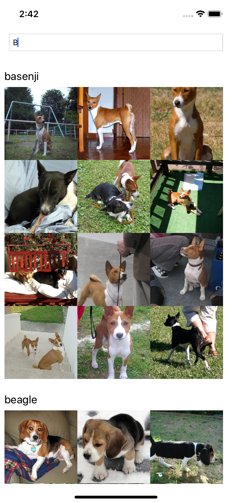
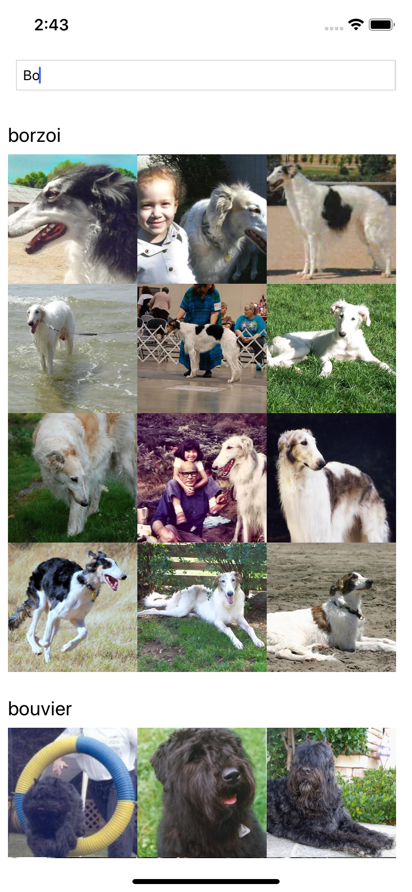

# Dog App

## Getting Started

### Cloning

`git clone https://github.com/lucasrocali/dog-app.git`

`cd dog-app`

### Installing

`yarn install`

### Running 

`yarn ios`

`yarn android`

`yarn web`